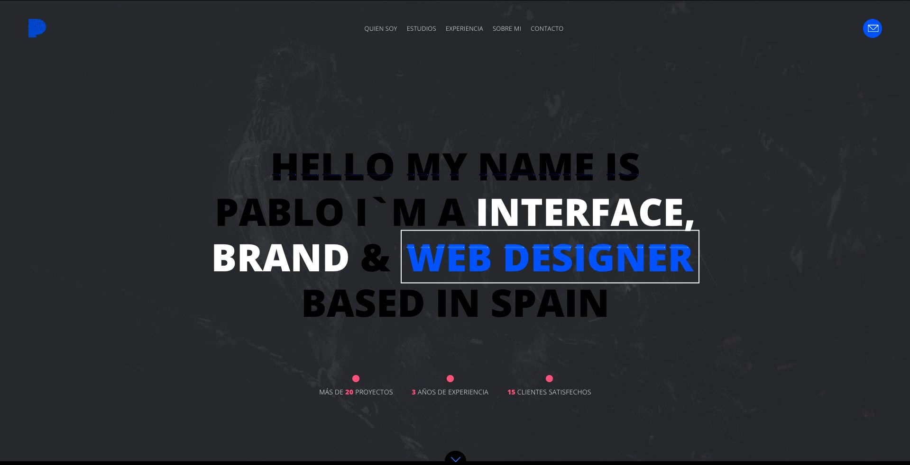

Proyecto Fundamentos Frontend
----------

Proyecto realizado para la práctica de fundamentos del frontend del Bootcamp de Keepcoding

**Portada**: 

* cuenta con una imagen de fondo ocupando el 100% del viewport.
* cuenta con una imagen de fondo ocupando el 100% del viewport.

**Quien soy**: 
* cuenta con una imagen de fondo ocupando el 100% del viewport.
* cuenta con una imagen de fondo ocupando el 100% del viewport.

